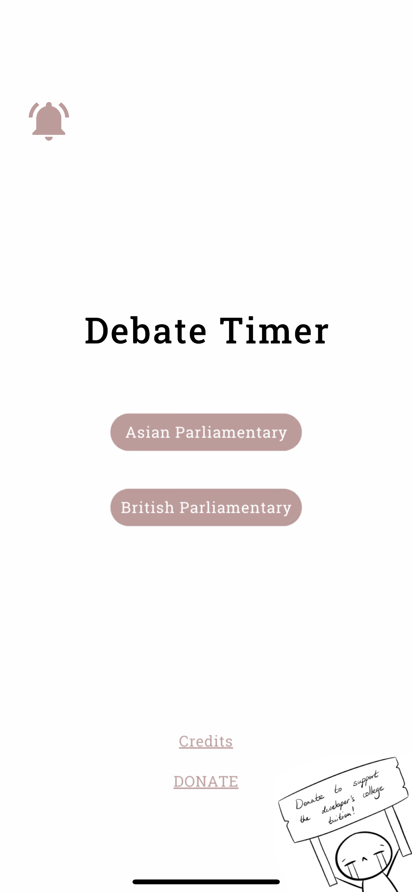

# Description
Source code for a debate timer designed for debaters and adjudicators. Supports Asian Parliamentary and British Parliamentary formats.  
Previously available on the App Store; currently unavailable due to developer membership expiration.

# Screenshots

Here are some screenshots of the project:

  
  
  
  
  

